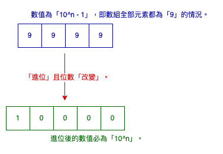

# LeetCode 0066. Plus One
Leetcode：Java


---

## 概要

#### 題目：[Plus One](https://leetcode.com/problems/plus-one/)

#### 難度：Easy

---

## 本文

#### 說明

題目會給我們一個「非空整數數列」，其代表著一個整數，舉例來說，數列內容為「{1, 2, 3}」，那其代表的整數就是「123」；而題目的要求如同其名稱：「加一」，而「123」加一就是「124」，所以我們就必須返回「124」的表示陣列，即「{1, 2, 4}」。

###### 限制：數值不存在先導「0」。

---

#### 解析一、暴力破解法

這題是入門款的「陣列與整數互相轉換」，難度不高；就算是以「土法煉鋼」的方式來解題，其程式邏輯也不會太複雜。

若以「土法煉鋼」的方式來解題，通常會分為兩個階段，第一階段是將「數列」轉換成「數值」；想當然耳，第二階段就是將「數值」轉換回「數列」，示意圖如下：


事實上，不論是將「數列」轉換成「數值」，亦或是將「數值」轉換回「數列」，在筆者的認知中，其方式通常就兩種，分別是「字串轉換」以及「數學運算」；於是乎，筆者就撰寫了初版的代碼，如下：

```java
class Solution {
    public int[] plusOne(int[] digits) {
        int digit = 0;

        // 第一階段：將「數列」轉換成「數值」
        for (int i = 0; i < digits.length; i++)
            digit += digits[i] * (int) Math.pow(10, (digits.length - 1 - i));

        String digitStr = String.valueOf(++digit);

        if (digitStr.length() == digits.length) { // 判斷「digit」長度

            // 第二階段：將「數值」轉換回「數列」
            for (int i = 0; i < digits.length; i++)
                digits[i] = Integer.parseInt(String.valueOf(digitStr.charAt(i)));
        } else {
            digits = new int[digits.length + 1];
            digits[0] = 1;
        }
        return digits;
    }
}
```

代碼非常地直覺，唯一比較須要注意的是「if」，它的目的是要判斷「加一」後數值的「位數」是否有「改變」；因為當位數「改變」，我們須回傳的陣列長度會不同。

事實上，以本題來說，「位數」只有在一個情況下會改變，就是該數值為「10＾n - 1」，也就是全部為「9」的情況，如下：



然後，筆者就把這段程式碼放到「LeetCode」上去驗證，結果顯示：「Wrong Answer」；其實思路是正確地，但問題在於「數值」的大小，所以筆者又嘗試了「long」、「double」；但通通闖關失敗；不是數值不夠，就是精度不足，實在令人生氣。

本來想著就算了，但無奈工程師之魂燃燒，上頭了的筆者被逼著拿出殺手鐧：「Big Number」，如下：

```java
import java.math.BigDecimal;
import java.math.BigInteger;

class Solution {
    public int[] plusOne(int[] digits) {

        BigInteger digit = BigInteger.ZERO;

        for (int i = 0; i < digits.length; i++)
            digit = digit.add(BigInteger.valueOf(digits[i]).multiply(BigDecimal.TEN.pow(digits.length - 1 - i).toBigInteger()));

        digit = digit.add(BigInteger.ONE);

        if (getBigIntegerNumLength(digit) == digits.length)
            for (int i = 0; i < digits.length; i++) {
                digits[digits.length - 1 - i] = digit.mod(BigInteger.TEN).intValue();
                digit = digit.divide(BigInteger.TEN);
            }
        else {
            digits = new int[digits.length + 1];
            digits[0] = 1;
        }
        return digits;
    }
    
    private int getBigIntegerNumLength(BigInteger digit) {
        int digitSize = 0;

        for (; !digit.equals(BigInteger.ZERO); digitSize++) 
            digit = digit.divide(BigInteger.TEN);
        return digitSize;
    }
}
```

呃⋯，什麼都別說！

總之，筆者不認為這是一個具有可讀性的代碼；但值得一提的是：「getBigIntegerNumLength()」，顧名思義，這個方式去來判斷「Big Number」的位數，在方法實作上，比較直覺得方式有二，第一種是「轉成字串」後在用「String.length()」，而另外一種就是如上面代碼中的，藉由除以「10」的方式來處理，但不論前後何者，其都不是一個有效率的方式。

於是筆者就在「StackOverFlow」上發現一種藉由「BigInteger.bitLength()」的解法，其原理也是藉由「數學運算」的方式；簡單的說，它先藉由「 BigInteger.bitLength()」去取得「Big Number」二進制的位數，再藉由「Log」來反推。

那「位數」跟「Log」有什麼關係呢？

首先要說明的是「位數」與「進制」的關係，以「十進制」來說，一個「位數」可以放「10」個數字，也就是說，「二位數、十進制」，可以放「10^2」、「三位數、十進制」，可以放「10^3」⋯以此類推；同理，「二進制」亦然，如「二位數、二進制」，能放的就是「2^2」、「三位數、二進制」，能放的就是「2^3」。

所以說，一「數值」的「位數長度」會取決於它可以放滿幾個位數。

假設數值是「N」，當我們對它取以「2」為底的「Log」時，在「二進制」的情況下，我們可以理解成其計算後數值的「整數」部分，就是代表著放滿的「位數」，若有餘下，就會變成「小數」的部分。

根據上述，所以我們只要得到該數值的「二進制」位數長度，先以底為「2」的「Log」反推後，再以底為「10」的「Log」取值，就能計算出該數值「十進制」的位數長度了。

原始文章請參考：「[BigInteger: count the number of decimal digits in a scalable method](https://stackoverflow.com/questions/18828377/biginteger-count-the-number-of-decimal-digits-in-a-scalable-method)」。

另外，還記得在文章前面有提到：「數組」與「數值」之間的轉換，不外乎就「字串轉換」或「數學運算」兩種；上述代碼是屬於「數學運算」的方式；而「字串轉換」的方式，其代碼如下：

```java
import java.math.BigInteger;

class Solution {
        public int[] plusOne(int[] digits) {

        StringBuilder builder = new StringBuilder();

        for (int digit : digits) builder.append(digit);

        String digitStr = new BigInteger(builder.toString()).add(BigInteger.ONE).toString();

        if (digitStr.length() == digits.length)
            for (int i = 0; i < digits.length; i++)
                digits[i] = Integer.parseInt(String.valueOf(digitStr.charAt(i)));
        else {
            digits = new int[digits.length + 1];
            digits[0] = 1;
        }

        return digits;
    }
}
```

是不是淺顯易懂的多；所以說，搞數學那幫人都是怪物，呃⋯是神。

#### 解析二、逐一判斷法

雖然「暴力破解法」的思路非常直接，但它們或多或少都存在一些問題，如「效能不差」、「代碼不直覺、可讀性差」⋯等；在多數時候，只要稍微調整一下思路，往往就會有更好的解決方式。

以本題來說：「加一」，其運算邏輯一定是從「個位數」開始，也就說，假設不管進位的話，題目給予的陣列與要求我們回傳的陣列，其差異只會在陣列的最末項元素，對其「加一」，如下：

```java
public int[] plusOne(int[] digits) {
    digits[digits.length - 1] += 1;
    return digits;
}
```

但問題是「十進制」，所以當該項元素為「9」時，我們必須進位；但仔細想想，「個位數進位」不就是意味著「十位數加一」且「個位數歸零」嗎；而同樣邏輯，「十位數進位」就代表「百位數加一」且「十位數歸零」⋯以此類推；所以這題我們只須要從「個位數」開始往前逐「位數」檢查，不是「9」的：對該項元素「加一」後返回；若是「9」的，將該項元素歸零，並往上一位數尋找，若上一位數為「9」的話，就同樣歸零再往前找，直接找到非「9」的元素，並對該元素「加一」後返回。

那倘若都是「9」呢？就如前述一樣，新增一個陣列，並將首項設為「1」即可；因為「整數陣列」預設值為「0」，代碼如下：

```java
class Solution {
    public int[] plusOne(int[] digits) {
        for (int i = digits.length - 1; i >= 0; i--)
            if (digits[i] != 9) {
                digits[i]++;
                return digits;
            } else digits[i] = 0;
        digits = new int[digits.length + 1];
        digits[0] = 1;
        return digits;
    }
}
```

---

###### tags: `LeetCode` `Easy`