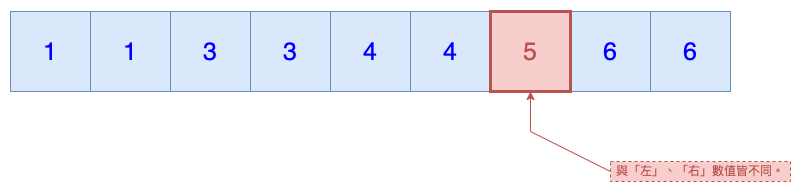

# LeetCode 0136. Single Number
Leetcode：Java

---

## 概要

#### 題目：[Single Number](https://leetcode.com/problems/single-number/)

#### 難度：Easy

---

## 本文

#### 說明

題目會給我們一個非空的整數陣列，數列中的所有整數皆為成對出現，唯有一個整數例外，它在數列中是唯一的存在；而題目就是要求我們找到那個唯一的整數。

###### 挑戰：演算法須為線性的時間複雜度以及常數的空間複雜度

---

#### 方式ㄧ、額外空間法

在不考慮「常數空間複雜度」的情況下，「額外空間法」無疑是最簡單易懂的解題方式；其核心邏輯就是：「宣告一個容器，並將整數逐一置入，在過程中，若容器內不含該整數就放入，已含該整數就移除。」。

在這個邏輯下，當陣列所有元素都被執行過以後，有「重覆」的整數會因為「一進一出」而不存在於容器內，而「唯一」的整數卻會因為該數值只出現一次的關係而只有執行「一進」的部分，卻不會執行「一出」的部分，因此，當所有元素都被操作過以後，容器內「剩下」的那個整數就是這個題目的答案，程式碼如下：

```java
class Solution {
    public int singleNumber(int[] nums) {
        Map<Integer, Boolean> map = new HashMap<>();
        for (int i : nums)
            if (map.put(i, true) != null) map.remove(i);
        return map.keySet().iterator().next();
    }
}
```

雖然「額外空間法」是一個淺顯易懂像是「土法煉鋼」的解題方式，但它的缺點也是相對明顯的，就是它需要一個非「常數空間複雜度」的容器。

此處的「容器」，不一定是「Map」，其它如「Set」、「List」⋯等，甚至是一般陣列都行；之所以選用「Map」是因為想利用「Map.put()」的回傳值作為判斷依據，讓寫法較簡潔。

---

#### 方式二、排序法

比起「額外空間法」的直覺暴力，「排序法」就相對地別具巧思。

該解法是利用「排序」的方式，當一整數數組依序排後，不論升降冪，其有重覆的整數必定兩兩相鄰，也就是說，只有唯一整數可以同時不等於左邊，也不等於右邊，示意圖如下：



原理說明完畢以後，再來就是實作的部分，而本題最關鍵的地方就是「排序」；在此處筆者偷懶一下，借用「Arrays.sort()」。

題外話，事實上，「排序」是這個解法的核心，但也是這個解法最尷尬的地方，原因是「排序」本身就沉載著一定的複雜度；這以後有機會筆者再談。

排序後，若依照我們的思路，比較直接的撰寫方式應如下：

```java
class Solution {
    public int singleNumber(int[] nums) {
        Arrays.sort(nums);
        if (nums.length == 1 || nums[0] != nums[1]) return nums[0];
        for (int i = 1; i < nums.length - 1; i++)
            if (nums[i] != nums[i - 1] && nums[i] != nums[i + 1]) return nums[i];
        return nums[nums.length - 1];
    }
}
```

雖然上述代碼兼具直觀、易理解，但在追求極致效能的情況下，我們可以針對它做一些優化。

仔細思考一下，因為重覆整數會相鄰的原因，其實我們並不需要在每個索引時都去判斷其「左邊」與「右邊」；意思是說，在依序大小排列的情況下，若索引「0」的數值與索引「1」的數值不同，則索引「0」必為該唯一值，但倘若索引「0」不是唯一值，則索引「1」必與其相同，也就是說，索引「1」也不會是唯一值，所以我們就不需要去判斷索引「1」。

因此，我們可以略過索引「1」，直接判斷索引「2」，而此時，索引「2」與索引「1」必然不同，所以索引「2」也不需要往左判斷，只須與索引「3」比較；若索引「2」與索引「3」不同，則唯一值就是索引「2」，若相同，那麼根據上面的經驗我們就可以知道，索引「4」可以被略過，直接判斷索引「5」⋯並以此類推，直到碰到「唯一值」。

而根據上述的邏輯，「for-loop」就可以一次遞增「2」；此外，「for-loop」內的「if」判斷式也可以稍微簡化，而改寫後的結果如下：

```java
class Solution {
    public int singleNumber(int[] nums) {
        Arrays.sort(nums);
        if (nums.length == 1) return nums[0];
        for (int i = 0; i < nums.length - 1; i += 2)
            if (nums[i] != nums[i + 1]) return nums[i];
        return nums[nums.length - 1];
    }
}
```

---

#### 方式三、互斥或法

不論是「額外空間法」的「容器」，還是「排序法」的「排序機制」，其實都無法滿足「挑戰」的要求：「線性的時間複雜度與常數的空間複雜度。」。

但目前介紹的「互斥或法」就可以滿足了；其主要是利用「x-or」的一個運算特性，即對同一數值互斥或兩次，會變回原來的數值，這與「互斥或」的運算規則有關。

因此，藉此特性，我們就可以簡單的找出「唯一值」，代碼如下：

```java
class Solution {
    public int singleNumber(int[] nums) {
        int res = 0;
        for (int i : nums) res ^= i;
        return res;
    }
}
```

若「Java」的版本為「8」以上，我們還可以用「Stream」的方式來撰寫出「一行解」，如下：

```java
class Solution {
    public int singleNumber(int[] nums) {
        return Arrays.stream(nums).reduce(0, (a, b) -> a ^ b);
    }
}
```

---

###### tags: `LeetCode` `Easy`