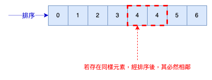

# LeetCode 0217. Contains Duplicate
Leetcode：Java


---

## 概要

#### 題目：[Contains Duplicate](https://leetcode.com/problems/contains-duplicate/)

#### 難度：Easy

---

## 本文

#### 說明

題目會提供我們一整數數列，並要求我們去判斷該數列中所有元素是否皆是唯一值。

###### 限制：所有整數皆為「唯一」存在。

---

#### 解析一、排序法

通常遇到這種與「找差異」相關的題型，其多數可以藉由排序法解決。

其主要邏輯就是：若兩個數列元素的數值相同，那一旦經排序，其兩者必會相鄰；所以要檢查該數列是不是唯一的方式就是，將該數列排序後，檢查每個元素與其相鄰的元素是否相同，若皆為不同，則可推斷該員數是唯一值，示意圖如下：



代碼如下：

```java
class MissingNumberSoft {
    public int missingNumber(int[] nums) {
        Arrays.sort(nums);
        for (int i = 0; i < nums.length; i++) if (i != nums[i]) return i;
        return nums.length;
    }
}
```

---

#### 解析二、容器法

除了「排序法」以外，「容器法」也是使用的解題方式。

以這題的情境，比較直觀的作法是使用「Set」，主要是藉由「Set」的特性：容器內元素須為唯一值。

實作方式就是將數列元素逐一放到「Set」後，去比對「Set」的「size()」與數列的「length」是否相同，若相同，則代表該數列的元素皆為唯一值，代碼如下：

```java
class Solution {
    public boolean containsDuplicate(int[] nums) {
        Set<Integer> set = new HashSet<>();
        for (int i : nums) set.add(i);
        return set.size() != nums.length; // 判斷個數是否相同
    }
}
```

如果使用「Stream」，可以達到一行解的效果，如下：

```java
class Solution {
    public boolean containsDuplicate(int[] nums) {
        return nums.length != new HashSet<>(Arrays.stream(nums).boxed().collect(Collectors.toList())).size();
    }
}
```

上面的作法是將全部「數列元素」都加入後，再一次判斷；但事實上，我們亦可以在每次加入元素時就判斷「Set」的「size()」有沒有加一，如下：

```java
class Solution {
    public boolean containsDuplicate(int[] nums) {
        Set<Integer> set = new HashSet<>();
        for (int i = 0; i < nums.length; i++) {
            set.add(nums[i]);
            if (set.size() == i) return true;
        }
        return false;
    }
}
```

事實上，除了「Set」以外，「Map」也挺適合的，其主要是利用「Map.put()」的回傳值作為判斷的依據；因為「Map.put()」的回傳值是「原本存在」的元素，也就說是，在「Map」為空的情況下，「Map.put()」會回傳「null」，因此我們只要將數列中所有元素一一加入，其回傳值若非「null」，則代表其存在「重覆元素」，程式碼如下：

```java
class Solution {
    public boolean containsDuplicate(int[] nums) {
        Map<Integer, Integer> map = new HashMap<>();
        for (int i : nums) if (map.put(i, 0) != null) return true;
        return false;
    }
}
```

---

###### tags: `LeetCode` `Easy`