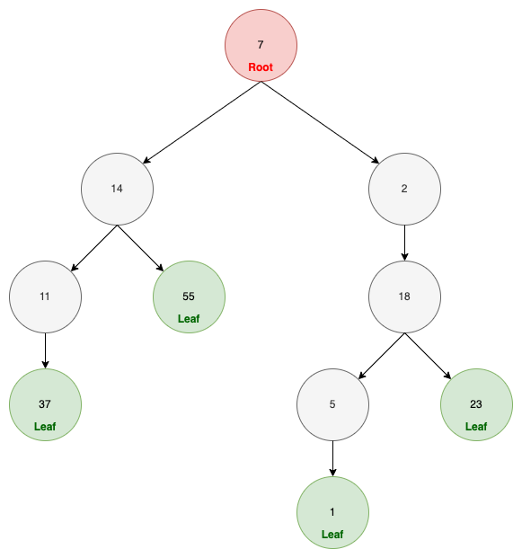
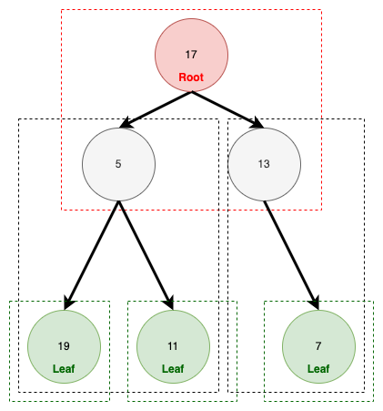

# LeetCode 0112. Path Sum
Leetcode：Java


---

## 概要

#### 題目：[Path Sum](https://leetcode.com/problems/path-sum/)

#### 難度：Easy

---

## 本文

#### 說明

題目會給我們一個「二叉樹（Binary Tree）」物件和一個「目標整數」。

然後要我們判斷該「二叉樹」物件中，其任意一條「A Root-to-Leaf Path」的數值總和，是否等於該「目標整數」。

其中，「A Root-to-Leaf Path」的意思是，從「根」到「葉」所經過的所有節點；「根（Root）」指的是最頂端的那個節點、而「葉（Leaf）」則是指最末端的節點，也就是沒有任何子項的節點，示意圖如下：



---

#### 解析ㄧ、遞迴法

遞迴函式，簡單說，就是一種在自己的方法中再呼叫自己的「手法」；詳細內容請參考：「[遞迴](https://en.wikipedia.org/wiki/Recursion_(computer_science))」。

因為「遞迴」是一種呼叫自己的循環，所以一定要設置「終止條件」，否則將會陷入「無窮」的自我呼叫，直到「OOM」。

而依照本題來說，「終止條件」是「葉」，程式碼如下：

```java
// 代表該節點為「葉」
if (root.left == null && root.right == null) return targetSum == root.val;
```

那如果不是「葉」，那就代表其可能有「左」、「右」腳；因此，直接將之丟入函式判斷，如下：

```java
// 代表「左」、「右」腳至少其一有值，所以再遞迴判斷
return hasPathSum(root.left, targetSum - root.val)
                || hasPathSum(root.right, targetSum - root.val);
```

因為遞迴是「分層處理」的概念，如下圖：



圖中的每一個框框，都屬於一個單位，也就是說，每層的處理邏輯都必須一致且相對獨立；因此當我們要往下層呼叫時，我們傳入的參數是「targetSum」，就必須要扣除當前「val」值；因為題目的要求是路徑上所有的數值總和，所以我們就必須將路過的值扣除。

另外，由於此處的邏輯，「root.left」與「root.right」是有可能為「null」，所以必須再一開始就先做「null」處理；完整代碼如下：

```java
class Solution {
    public boolean hasPathSum(TreeNode root, int targetSum) {
        if (root == null) return false;

        // 代表為葉
        if (root.left == null && root.right == null) return targetSum == root.val;

        return hasPathSum(root.left, targetSum - root.val)
                || hasPathSum(root.right, targetSum - root.val);
    }
}
```

---

#### 解析二、迴圈法

由於「遞迴」是「分層處理」的概念，且每層的邏輯一致；因此，如果一個題目有「遞迴式」的解題方式，就一定會有「迴圈式」的解題方式。

其實兩種方式的解題思路都是相同地，實作代碼如下：

```java
class Solution {
    public boolean hasPathSum(TreeNode root, int targetSum) {
        Stack<TreeNode> trees = new Stack<>();
        Stack<Integer> sums = new Stack<>();
        trees.push(root);
        sums.push(targetSum);
        while (!trees.isEmpty() && (root != null)) {
            int target = sums.pop();
            TreeNode top = trees.pop();
            if (top.left == null && top.right == null
                    && top.val == target) return true;
            if (top.right != null) {
                trees.push(top.right);
                sums.push(target - top.val);
            }
            if (top.left != null) {
                trees.push(top.left);
                sums.push(target - top.val);
            }
        }
        return false;
    }
}
```

在「Loop」的解法中，我們只是想一層層的「遞迴」拆解成「迴圈」，僅只而已。

---

###### tags: `LeetCode` `Easy`