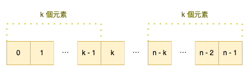
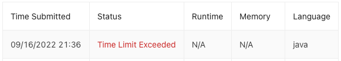
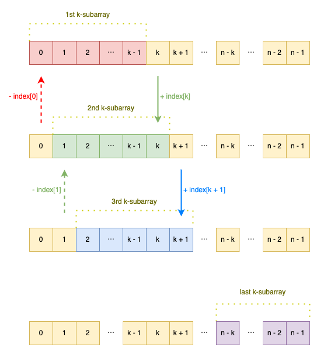
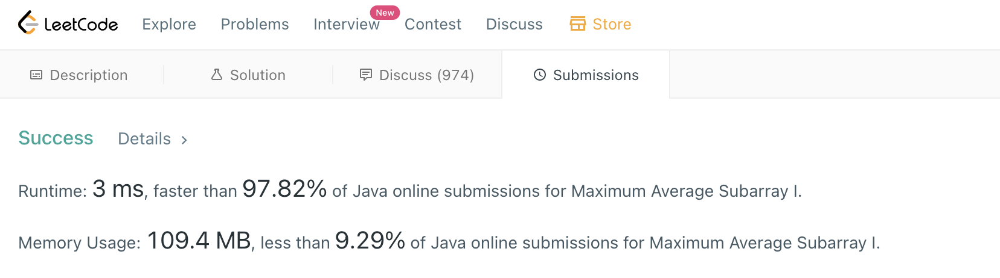

# LeetCode 0643. Maximum Average Subarray I
Leetcode：Java


---

## 概要

#### 題目：[Maximum Average Subarray I](https://leetcode.com/problems/maximum-average-subarray-i/)

#### 難度：Easy

---

## 本文

#### 說明

題目會給我們一個由「n」個元素所組成的整數數列：「nums」，以及一個整數「k」；然後要求我們返回在「整數數列」中，連續「k」個元素數值總和的「最大平均值」。

###### 限制：整數數列「nums」的長度為「n」。

---

#### 解析一、暴力破解法

在開始解析題目之前，我們先來定義一下名詞；以下本文會將「連續『k』個元素組成的次陣列」稱之為「K Array」。

以這題來說，其實直接以「暴力破解」的方式即可以解決；其概念就是將所有的「K Array」個別計算出來後，再以兩兩相比的方式找出最大值。

按著這個思路來實作，其最直覺的方式就是利用雙層迴圈，代碼如下：

```java
class MaximumAverageSubarrayIBruteForce {
    public double findMaxAverage(int[] nums, int k) {
        int tempSum, maxSum = Integer.MIN_VALUE;
        for (int i = 0; i <= nums.length - k; i++) {
            tempSum = 0;
            for (int j = 0; j < k; j++) tempSum += nums[i + j];
            maxSum = Math.max(maxSum, tempSum);
        }
        return ((double) maxSum) / k;
    }
}
```

上述代碼中，外層的迴圈是針對「整個數列」遍歷，其中的「i」即代表著各個「k」數列的起點；而外層迴圈的終點則為「nums.length - k」，概念如下：



接著再藉由內層迴圈依序地將各個「K Array」的數值加總，並兩兩相比取其高。

然而，當外層迴圈執行到索引起始為「nums.length - k」時，即意味著我們已經將「整個數列」中所有可能的「k」數列都輪詢過了；因此，將「最大值」除以「k」的值即為題目所需的答案。

但實際於「LeetCode」上運行時卻會噴出錯誤，如下：



錯誤是「Time Limit Exceeded」，這是因為「雙層迴圈」的效能實在太差；但該邏輯是沒有問題的，事實上幾年前筆者曾以同樣的代碼執行通過；大概是「LeetCode」的限制越來越嚴格了吧。

---

#### 解析二、差異法

實際上，「差異法」與「暴力破解法」的思路非常相似；其唯一地不同在於：「差異法不再須要一個一個地將每個『K Array』加總後比較；而是去直接去比較每個『K Array』差異的部分。」。

簡單說，若我們以一個「K Array」為「單位」，並以索引「0」至索引「k - 1」的「K Array」作為基準；而它與下一個「K Array」，也就是與索引「1」至索引「k」的「K Array」差異在於後者多了第「k」項，且少了第「0」項。

而下一個「K Array」、下下一個「K Array」的差異皆是類推，示意圖如下：



根據此邏輯，其實實作如下：

```java
class Solution {
    public double findMaxAverage(int[] nums, int k) {
        int tempSum = 0, maxSum;
        for (int i = 0; i < k; i++) tempSum += nums[i]; // 建立基準值

        maxSum = tempSum;
        for (int i = k; i < nums.length; i++) {
            tempSum += nums[i] - nums[i - k]; // diff
            maxSum = Math.max(maxSum, tempSum);
        }
        return ((double) maxSum) / k;
    }
}
```

同樣將代碼放到「LeetCode」上執行，結果「輕鬆通過」，如下：



由此可見，「兩次迴圈」遠比「雙層迴圈」有效率許多；那能不能「一個迴圈」呢？

事實上是可以的，同樣是「差異法」，我們只是將「第一個迴圈」，也就是建立基準值的部分與比較差異的部分合併處理而已，代碼如下：

```java
class Solution {
    public double findMaxAverage(int[] nums, int k) {
        int tempSum = 0, maxSum = Integer.MIN_VALUE;
        for (int i = 0; i < nums.length; i++) {
            tempSum += (i <= k - 1) ? nums[i] : nums[i] - nums[i - k];
            if (i >= k - 1 && tempSum > maxSum) maxSum = tempSum;
        }
        return ((double) maxSum) / k;
    }
}
```

雖然程式碼略顯難讀，但邏輯與思路是完全一樣的。

---

###### tags: `LeetCode` `Easy`