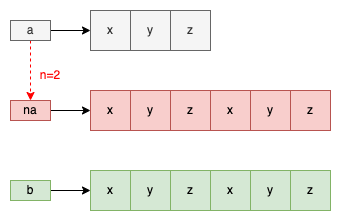

# LeetCode 0686. Repeated String Match
Leetcode：Java


---

## 概要

#### 題目：[Repeated String Match](https://leetcode.com/problems/repeated-string-match/)

#### 難度：Medium

---

## 本文

#### 說明

題目給我們兩個字串，分別為「a」字串與「b」字串；然後要求我們去判斷「a」字串或是當其重覆了多次以後，是否能夠包含「b」字串；也就是問，「b」字串是否為「a」字串或是「n * a」字串的「子字串」。

###### 限制：字串「a」與「b」的長度至少為「1」。
###### 限制：字串「a」與「b」的組成皆為英文小寫字母。

---

#### 解析一、長度判斷法

分析一下題目的描述，首先，題目的問題是「b」字串是否為「a」字串或是「n * a」字串的「子字串」。


；這意味著「a」字串或是「n * a」字串其可能大

在「母字串」的字串長度必須大於或等於「子字串」先決條件下；

若要「b」字串為「子字串」


若，那麼也就意味著

有可能為「母字串」；也就是說，其長度必須大於或等於「b」字串的長度。

因此，我們只要將「b」字串長的度除以「a」字串的長度，就可以推算出可能的「母字串」長度。


```java
int n = (int) Math.ceil((double) b.length() / a.length());
```

要注意的是，此處須用「Math.ceil()」來取值，也就是須「向上取整」，這是因為「母字串」必不能小於「子字串」，且「repeat」的最小單位是一個完整「a」字串。

由上可以得知，「na」字串的長度至少會大於或等於「b」字串的長度；而如果「b」字串是「na」字串的「子字串」，那麼「b」字串的最大可能就是與「na」相同。

以「a」字串為「"xyz"」、「b」字串為「"xyzxyz"」為例，示意圖如下：



此時，若再將「a」多重覆一次，變成「naa」，則「"yzxyzx"」與「"zxyzxy"」，如下：


那麼也

為的情況，


也就是說，字串的長度是大於「」


字串就是「母字串」的最小可能。


因此就會藉由「contains()」來判斷「b」字串是否為「na」字串的「子字串」，如果是，「n」就是答案。

但如果不是呢？


其實只要在「na」字串後，再補上一次「a」字串，即為「(n + 1) * a」字串；並以此字串再判斷一次；若是，「n + 1」就是答案，若否，直接返回「-1」；這是因為，如果字串「(n + 1) * a」也不是字串「b」的母字串，那麼就算重覆再多次「a」，其「na」都不可能為「b」的「母字串」。

其實原理很簡單，在「na」字串的長度大於「b」字串的前提下，

---

#### 解析二、數學運算法


---

###### tags: `LeetCode` `Easy`