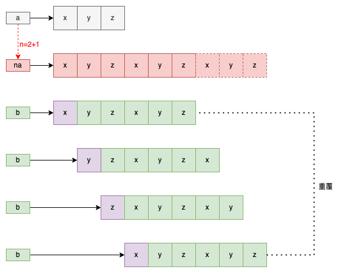

# LeetCode 0686. Repeated String Match
Leetcode：Java


---

## 概要

#### 題目：[Repeated String Match](https://leetcode.com/problems/repeated-string-match/)

#### 難度：Medium

---

## 本文

#### 說明

題目給我們兩個字串，分別為「a」字串與「b」字串；然後要求我們去判斷「a」字串或是當其重覆了多次以後，是否能夠包含「b」字串。

###### 限制：字串「a」與「b」的長度至少為「1」。
###### 限制：字串「a」與「b」的組成皆為英文小寫字母。

---

#### 解析一、長度判斷法

根據題目的描述，題目的問題是當「a」字串重覆了「n」次以後，「b」字串是否可能為其「子字串」。

而以常理來說，「母字串」的字串長度必須大於或等於「子字串」的字串長度；所以，「n * a」字串的長度必須大於或等於「b」字串；因此我們就可以藉由數學運算的方式來求出「n」的最小可能值，如下：

```java
int n = (int) Math.ceil((double) b.length() / a.length());
```

要注意的是，此處必須以「向上取整」的方式來處理，這是因為「repeat」一次是添加一個完整的字串「a」。

根據上述邏輯得到「na」字串，只是可能為包含「b」字串，而不是一定會包含；因此，我們要再藉由「contains()」函式來判斷「na」字串是否有包含「b」字串；若是，則返回「n」。

若否，其實我們只要在「na」字串後面，再「重覆」一次「a」字串，使之變成「naa」字串，然後同樣再以「contains()」函式再判斷一次；若是，就返回「n + 1」，與之前相同，但不同的是，若這次判斷結果能為「否」，那麼就不需要再「重覆」一次「a」字串後再判斷，而是直接返回「-1」即可；這是因為，如果連「(n + 1) * a」字串都不是「b」字串的「母字串」，那麼就算往後再多重覆幾次「a」也沒用，其結果都會是同樣的。

這其實與重覆「a」字串有關，倘若「b」字串要為是「n * a」字串的「子字串」，那麼「b」字串的字母排序一定要遵循「a」字串循環的字母排序；換句話說，對「子字串」而言，在字母排序固定的情況下，其只有「起點」、「長度」的差異。

以「起點」不同來說，其起點的位置也就「a.length()」種；而「長度」，最長就是等於「na」字串的長度。

總和上述，若「b」字串為「n * a」字串的「子字串」，那麼「naa」一定就包含了所有可能，範例如下：



而完整的代碼如下：

```java
class Solution {
    public int repeatedStringMatch(String a, String b) {
        int n = (int) Math.ceil((double) b.length() / a.length());
        return a.repeat(n).contains(b) ? n : a.repeat(n + 1).contains(b) ? n + 1 : -1;
    }
}
```

---

###### tags: `LeetCode` `Medium`