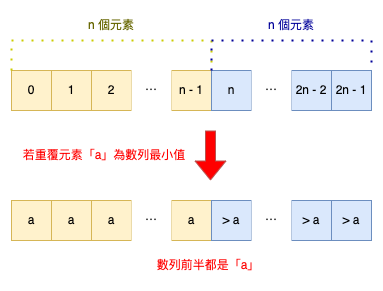
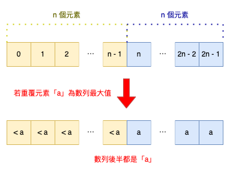
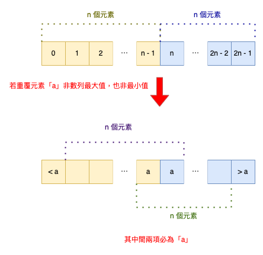

# LeetCode 0961. N-Repeated Element in Size 2N Array
Leetcode：Java


---

## 概要

#### 題目：[N-Repeated Element in Size 2N Array](https://leetcode.com/problems/n-repeated-element-in-size-2n-array/)

#### 難度：Easy

---

## 本文

#### 說明

題目會給我們一長度為「2n」的整數數列，內含「n + 1」個不同的元素且其中的「n」個元素為唯一值，僅有一個元素會重覆出現；題目要求我們找出那個會「重覆出現」的元素。


###### 限制：「n」大於等於「2」。

---

#### 解析一、容器法

這題與「[Contains Duplicate](https://leetcode.com/problems/contains-duplicate/)」類似，目標都是找出數列中重覆的元素。

那既然是找出「重覆元素」，其同樣地也可以使用「排序法」、「容器法」⋯等方式解題；事實上，以這題來說，「容器法」是相對直觀的方式。

首先，我們須要宣吿一個「容器」作為存放數列元素的空間，接著就將「數列元素」逐一放入該容器中；除了第一次放入外，其餘每次將數列元素放入容器前都要先檢查「當前容器中」是否已經存同樣地元素，若有，則返回該元素，若無，才能將該元素放被宣告出來的容器中。

以「List」為例，我們可以藉由「contains()」來檢查容器內是否已存在該元素，實作代碼如下：

```java
class Solution {
    public int repeatedNTimes(int[] nums) {
        List<Integer> list = new ArrayList<>();
        int i = 0;
        do list.add(nums[i++]);
        while (!list.contains(nums[i]));
        return nums[i];
    }
}
```

上述實作我們也可以用「Set」來替代「List」；事實上，Set」同樣有「contains()」這個方法；不過既然都已經使用「Set」，就別忘了「Set」的一個重要特性：會剔除重複元素；也就是說，我們亦可以藉由「Set.size()」來判斷，代碼如下：

```java
class Solution {
    public int repeatedNTimes(int[] nums) {
        Set<Integer> set = new HashSet<>();
        int i = 0;
        do set.add(nums[i++]);
        while (set.size() == i);
        return nums[i - 1];
    }
}
```

以「Map」為容器的話，代碼如下：

```java
class Solution {
    public int repeatedNTimes(int[] nums) {
        Map<Integer, Integer> map = new HashMap<>();
        for (int i : nums)
            if (map.put(i, i) != null) return i;
        return -1;
    }
}
```

#### 解析二、排序法

與「[Contains Duplicate](https://leetcode.com/problems/contains-duplicate/)」一樣，這題也能使用「排序」的方式來解題。

在「[Contains Duplicate](https://leetcode.com/problems/contains-duplicate/)」中，我們將數列經過排序後，去檢查左右兩鄰是否相同的邏輯，在這題依樣畫葫蘆同樣適用；但這題其實有更具巧思的解題方式，同樣是藉由排序的方式。

我們先來分析題目：「長度 2n」、「n + 1 種元素」、「僅一個重複」，根據這三個描述，我們可以總結：「數列的元素為『2n』個，而重複的元素為『n』個。」。

換句話說，在該數列中，有一半的元素其數值相同；在這個前提下，若重覆的「n」個元素是數列中的「最小值」，則代表該數列經排序後，其「前一半」的元素皆為「重覆的元素」，如下：



反之，若重覆的「n」個元素是數列中的「最大值」，則該數列經排序後，其「後一半」的元素就會都是重覆的元素，如下：



那如果重覆的「n」個元素非數列的「極端值」，那麼意味著其「中間項」，也就是第「n - 1」項和第「n」項必為重覆的元素，如下：



根據上述的思路，我們來整理實作邏輯，如果「中間兩項」相等，則該兩項的元素數值就為「返回值」；若不相等，那麼要其就有可能是「首項」或「末項」，是吧？

再換句話說，如果「首項」與「第『n - 1』項」相同，即意味著重覆的「n」個元素是數列的「最小值」；返回「首項」數值即可。

反之，「首項」與「第『n - 1』項」不同，那麼其可能有種情況，第一種是重覆的「n」個元素是數列的「最大值」，或是其中間兩項必為重覆的「n」個元素；而這兩種情況，有一個共通點，就是其「第『n』項」都是重覆的那個元素。

順著上述的邏輯，其程式碼如下：

```java
class Solution {
    public int repeatedNTimes(int[] nums) {
        Arrays.sort(nums);
        return nums[nums[0] == nums[nums.length / 2 - 1] ? 0 : nums.length / 2];
    }
}
```

---

###### tags: `LeetCode` `Easy`